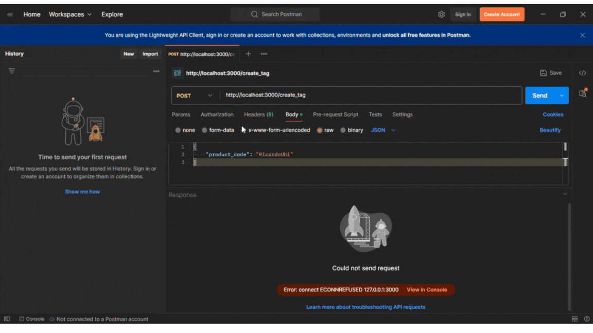
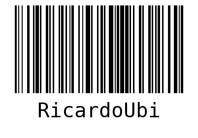
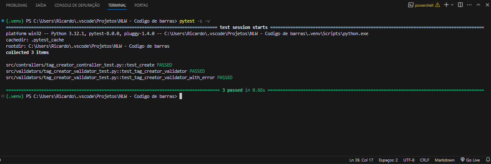

# Python - Gerador de Código de Barras

O Gerador de Código de Barras é uma aplicação web escalável, construída com uma arquitetura de software robusta. Sua principal funcionalidade é gerar códigos de barras a partir de números ou strings fornecidos, simplificando processos que dependem dessa codificação para identificação e rastreamento de itens.


## Tecnologias Utilizadas:

- [Python](https://www.python.org/): Python é uma linguagem de programação.
- [Flask](https://flask.palletsprojects.com/): Framework para hospedagem web;
- [Pylint](https://pylint.pycqa.org/): Ferramenta que verifica o código Python em busca de erros e padrões de programação.
- [Pytest](https://pytest.org/): Framework de teste para Python. 
- [Pillow](https://python-pillow.org/): Biblioteca de processamento de imagem em Python.
- [Cerberus](https://docs.python-cerberus.org/): validador de dados em Python.
- [Pre-commit](https://pre-commit.com/): Ferramenta que permite configurar e executar ganchos (hooks) Git em um repositório de código.
- [Python-Barcode](https://python-barcode.readthedocs.io/en/stable/): Biblioteca para criar códigos de barras em Python.
- [Virtualenv](https://virtualenv.pypa.io/en/latest/): Ferramenta para criar ambientes Python isolados.

O projeto também inclui testes unitários abrangentes e segue padrões de código estritos definidos pelo Pylint, facilitando os testes e o versionamento do código entre equipe de desenvolvimento.

## Demostração:
Utilizei o Postman para fazer o Post no localhost. Confira abaixo.

<div align="center">
  
</div>

<div align="center">
  <p>Resultado</p>
  
</div>

## Testes Unitarios:
Para fazer os testes unitarios, foi utilizado o Pytest, e você encontrara alguns testes neste projeto. Para testa-los você pode:

### Como testar:

      // Digite no terminal
      pytest -s -v
    

<div align="center">
  <p>Resultado</p>
  
</div>


## Como utilizar

1. Clone o repositório:

   ```terminal
   git clone https://github.com/RicardoUbi/Python-Codigo-de-barras.git

2. Execute o programa

    ```terminal
      python run.py
    ```

### Divirta-se!
   
